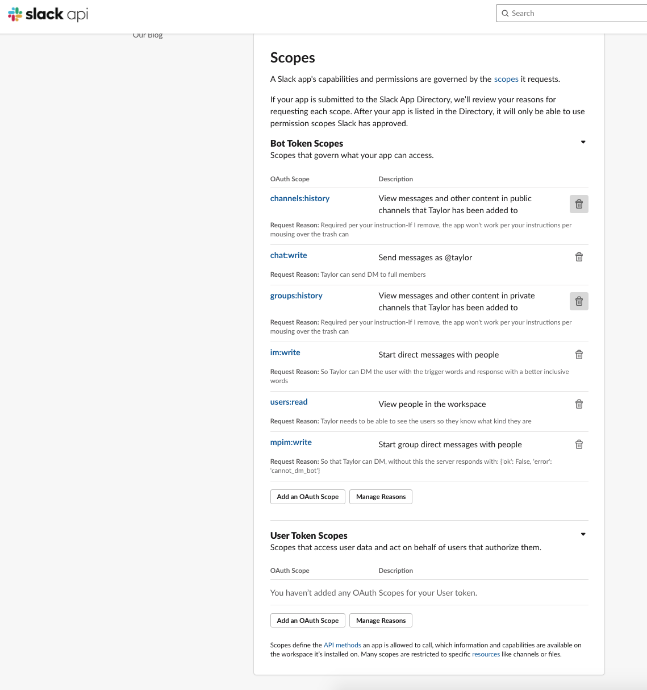

# Installing Taylor Locally:

Thank you for contributing to Taylor to help make them a better Slack bot! 

In this document, you will learn how to install Taylor locally so you can add them to your own workspace.  

## Getting Started:  

1.  First, go to [Creating the Slack App](#Creating-the-Slack-App).
1.  Fork and clone [Taylor's repo](https://github.com/gettaylor/taylor).
1.  You will need to have a Slack Workspace. You can either Sign into your existing workspace or create a new one.
1.  You will need to have Python 3.6 or higher.  
1.  Create a new project folder and virtual environment.  
1.  [After completion, invite Taylor](#After_Creating_the_Slack_App).  
```  
mkdir taylor  
cd taylor 
git clone git@github.com:your-handle/taylor.git
python3 -m venv env  
source env/bin/activate  
pip3 install -r requirements.txt
python3 app.py
export SLACK_CLIENT_SECRET=(the client secret on app creds page)
export SLACK_CLIENT_ID=(the client id on app creds page)
export SLACK_CLIENT_SECRET=(the client secret on app creds page)
```  
In another terminal window:
```
ngrok http 3000
```
And be sure to update the Events Subscription Request URL in Enable Events box.  

## Creating the Slack App:  

1.  Create a new Slack App [slack.api.com](https://api.slack.com/apps?new_app=1).  
    * App name is Taylor.  
    
    * Select the workspace you want to put the app on and you'll move to the Basic Infomation Page.
     
1.  Give the app permissions by adding [Scopes](https://api.slack.com/scopes). 
    * Go to **OAuth & Permissions** menu on the left to add the scopes.  
         
    * Add these **Bot Token Scopes**:
    ```
        channels:history
        chat:write
        groups:history
        im:write
        users:read
    ``` 
    
    * Scroll back to the top and be sure you have your ngrok running and added to the Redirect URL and click **Install App to Workspace**  
      
    * Select the workspace you want to put the app on, then click **Allow**.  
      
      
1.  Go to the **Events Subscriptions** page, toggle to On, to enable all Slack Events to be seen.  
      
      
    *  Subscribe to these events:  
    **Subscribe to bot events**  
     ```
        app_uninstalled
        message.channels
        message.groups
    ```
Now you should be good to go. I do use Flask_SQLAchemy and Posgres for managing the database. You can change how that works when you go to the file  
```
app.py
``` 
scoll down to the decorator  
```
@taylor_app.route("/finish_auth", methods=["GET", "POST"])
```
and look through there. The database is started there and then again referenced in in the top event listener.  

## After Creating the Slack App:  
You're good to go with Taylor. All that's left is to invite them into any channel you'd like:
```
/invite @taylor
```