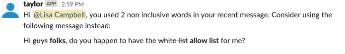

# Taylor

Taylor is a non binary, open source Slack App that when installed on a workspace, will DM only multi-channel users if they use any of the predefined, non inclusive words. 

The original conversation:
  

Here in an example of what Taylor's alert will look like:
 

You can then edit the message and use Taylor's instead. 

I am currently writing this as a fun side project so I can understand Python better and how to use the Slack Events API. 

Let me know your thoughts and feedback as Taylor continues to improve as they are a work in progress.

## Technology Used:
* Python 3
* Slack Events API
* Slack WebClient
* Flask-SQLAlchemy
* Flask
* Postgres
* ngrok
* Netlify
* Heroku 